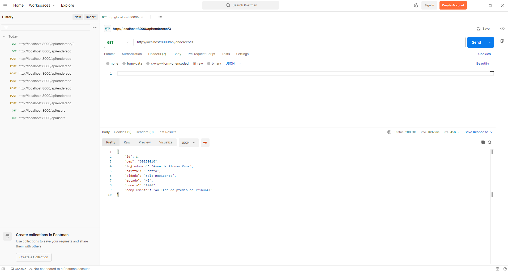

## Introduction

This project aims to provide an API in Laravel to perform user registration, allowing a frontend (such as Vue.js, React, or other) to interact with the application to register, view, edit and delete users. The API will be ready to be consumed in web or mobile systems.

## Resources

- PHP 8.1 programming language;
- Laravel Framework 10.48.25
- PostgreSQL 15.4 Open Source Database;
- Docker Desktop 4.36.0;
- Postman Version 11.21.0;

## Guidance

- The **cadastro.sql** file contains a copy of the database used. 
- The **docker-compose.yml** file contains a configuration to create a container in docker, you need to change the location of the project in this line of code **C:/laravel:/app** replacing C:/laravel with a location of your preference where the project is located.

## Endpoint Users

- GET /users: Lists all users.
- GET /users/{id}: Displays a specific user.
- POST /users: Creates a new user.
- PUT /users/{id}: Updates an existing user.
- DELETE /users/{id}: Deletes a user.

|  |  |  |  |  |
|---|---|---|---|---|

## Endpoint Endereco

- GET /endereco: Lists all address.
- POST /endereco: Creates a new address.
- GET /endereco/{id}: Displays a specific address.
- PUT /endereco/{id}: Updates an existing address.
- DELETE /endereco/{id}: Deletes an address.

|  |  |  |  |  |
|---|---|---|---|---|

## Starting the application
Before you begin, make sure you have docker installed and configured correctly on your machine. Change the path of your project folder in **docker-compose.yml** anf follow the step below:

1. Open the terminal and navigate to the directory where the project files were saved.

2. Run the command below to starting the application.

```
docker-compose up
```